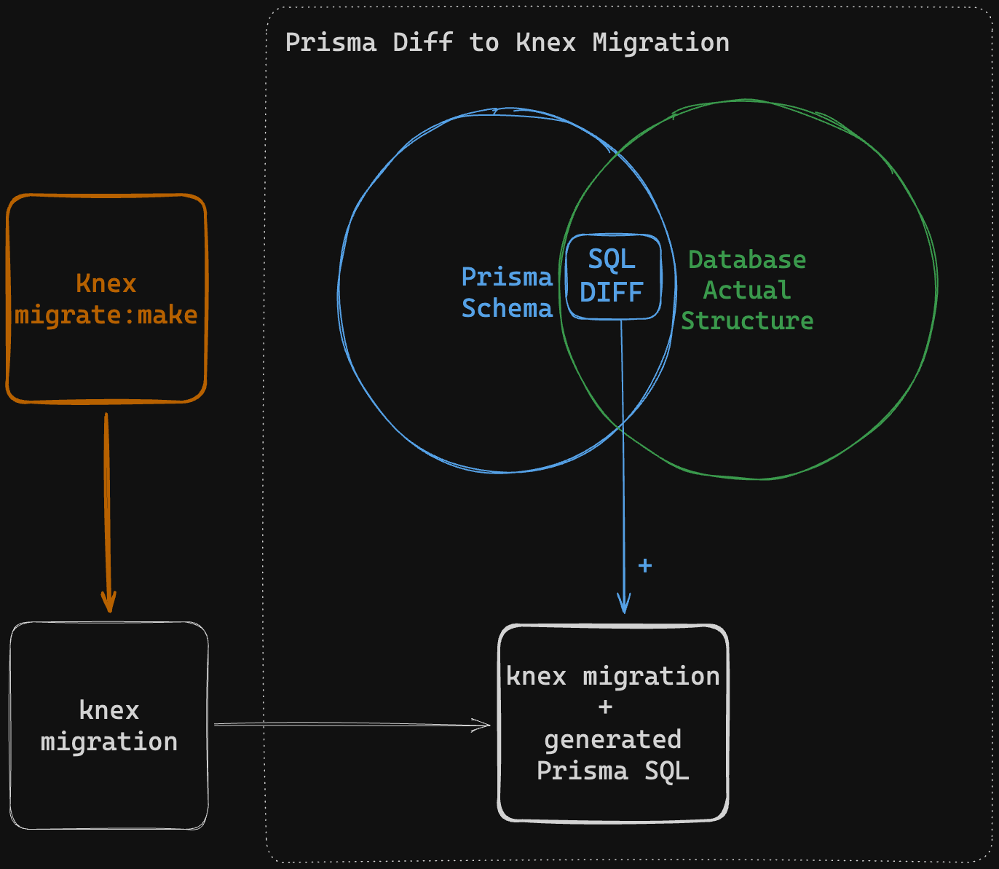

## Description
Using Knex to run migrations, while keeping Prisma as the source of truth? This script lets you use Prisma to build a starting SQL script, when creating knex migrations.


## Setup and Usage
**You will probably want to run this other script I made first, to set everything up: [prisma-migration-migrator](https://github.com/spersico/prisma-migration-migrator).** This will set up Knex on an existing Prisma project. Otherwise, Prisma might output SQL related to the knex migrations history table, which you probably don't want.

---

**Assuming you have Prisma and Knex set up**, just add this package to your project to start using it.

1. **First, install the dev-only dependency**: 
    ```bash
    npm install -D prisma-diff-to-knex-migration
    ```
    
2. **Then, when you want to change something in your DB (like adding a field or something), update your Prisma Schema file first!**

3. **Then, pipe this script to your knex migration creation script**: 
    ```bash
    npx knex migrate:make 'example_migration_name' | npx prisma-diff-to-knex
    ```
    The script will replace the starting content of the migration file with the SQL generated by Prisma.
    > This script will never run the migration, it will only generate the SQL for it. You will still need to run the migration with `npx knex migrate:latest`.
  
## How does it works?
The script picks up the path of the migration from the knex migration creation script, and then generates a SQL migration based on the difference between the Prisma datamodel (the schema), and the datasource (your DB).

**This means that the SQL generated will depend on the current state of your Prisma Schema file, and the current state of your database**. If you have a migration pending, it will generate the SQL for that migration. If you have no pending migrations, it will generate an empty SQL file.




The SQL comes from running `npx prisma migrate diff --from-schema-datasource ${schemaPath} --to-schema-datamodel ${schemaPath} --script`, where `${schemaPath}` is the path to the Prisma schema.
Then it picks up the SQL sentences, and replaces the content of the migration file with them.